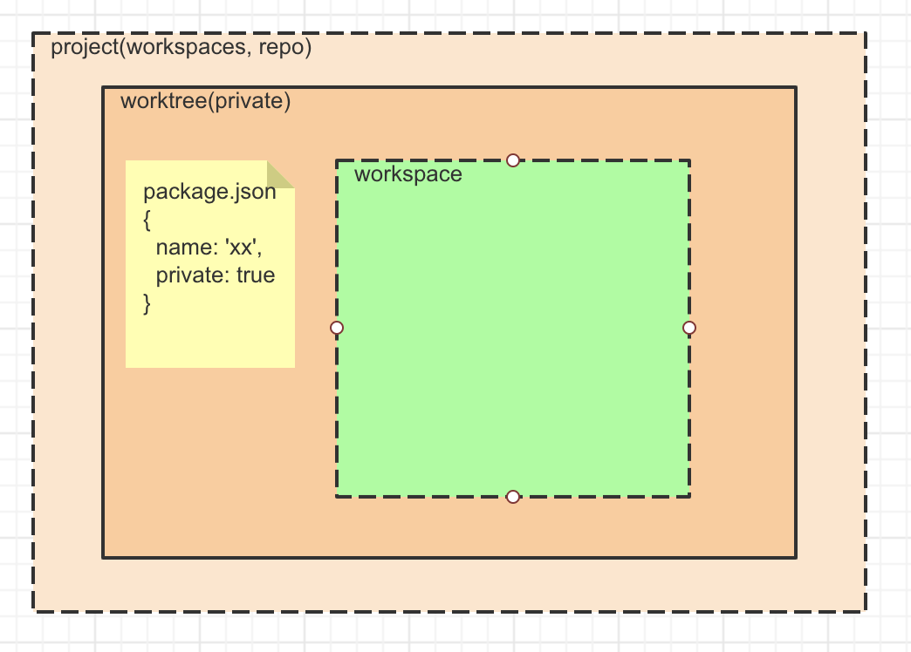

# Yarn2的新功能

## 离线存储

当你使用yarn2从远程安装第三方包时，yarn2会生成一份第三方包的拷贝并以.zip的格式存放在本地。文件名的格式为：

```
[@scope]-packageName-registry-packageVersion-hash.zip
```

当你下一次从同样的来源安装相同版本的同一个包时，yarn将直接从本地存储中读取，而不是远程下载，从而加快再次安装的速度。

离线存储的默认地址是 _`projectRoot/.yarn/cache`文件夹_，可以在 _`projectRoot/.yarnrc.yml`_ 文件中修改`cacheFolder`进行配置。如果你不想让离线包裹数据放在项目目录中，也可以通过启用`enableGlobalCache`选项，启用全局的离线存储，所有下载的包将被存放在一个全局统一目录中，你系统中的所有项目都可以使用这里的缓存加快二次安装速度。

```yml
# 修改存放目录
cacheFolder: ".yarn/cache"
# or
# 启用全局的离线存储
enableGlobalCache: true
```

## Plug'n'Play

**背景：** node_modules存在大量问题

- 生成 node_modules 占用 yarn install 70% 以上的时间

  因为node_modules结构的原因，需要生成大量文件，大量的IO工作耗时较长。而且，IO 工作是系统级的，yarn很难对其进行优化

- node_modules 的结构缺陷，导致多余的空间占用

  当你的项目依赖第三方包 pkg1@x、pkg2@x、pkg3@5.0.0，而且pkg1@x，pkg2@x都依赖于pkg3@1.0.0，你的项目结构是这样的

   ```
   my-app
   |- node_modules
      |- pkg3@5.0.0
      |- pkg1
      |  |- node_modules
      |     |- pkg3@1.0.0
      |- pkg2
         |- node_modules
            |- pkg3@1.0.0
   ```
   你的项目中会存在多个pkg3@1.0.0的文件夹，即使它们内容都是一样，这无疑是浪费资源

- node 从node_modules中查找包裹的效率太低

  node 包查找策略非常耗时，需要大量的stat 或readdir操作。https://nodejs.org/api/modules.html#modules_all_together

**方案：** 

思考一下：yarn 负责将第三方包下载下来然后存放在本地，那么yarn 应该是知道关于包的所有路径信息的，那么如果让yarn 直接把这些路径信息直接告诉node，node就不用在查找包上花费大量精力了，从而也就能更快的启动项目。

**实现**

PnP生成一个.pnp.js文件，里面包含了所有关于当前项目依赖路径信息，指向第三方依赖的本地地址。另外，PnP不再生成node_modules文件夹，而是从上面说到的 _离线存储_ 的.zip文件中直接读取依赖文件。当node执行时，将直接根据.pnp.js文件中的路径信息请求资源，而不用像以前一样需要大量查找工作。

.pnp.js文件中保存的路径信息：
```javascript
 [
   ["object-assign", [
        ["npm:4.1.1::__archiveUrl=https%3A%2F%2Fregistry.npm.taobao.org%2Fobject-assign%2Fdownload%2Fobject-assign-4.1.1.tgz", {
          "packageLocation": "./.yarn/cache/object-assign-npm-4.1.1-8ceeb17134-66cf021898.zip/node_modules/object-assign/",
          "packageDependencies": [
            ["object-assign", "npm:4.1.1::__archiveUrl=https%3A%2F%2Fregistry.npm.taobao.org%2Fobject-assign%2Fdownload%2Fobject-assign-4.1.1.tgz"]
          ],
          "linkType": "HARD",
        }]
      ]]
 ]
```
**PnP的优势**

- 没有了node_modules，不需要生成大量文件，安装速度加快

- 依赖于离线存储，更节省硬盘资源

  - 离线存储会自动压缩、优化文件，最终以 .zip格式存放，节省大量硬盘空间
  - 离线存储的扁平化结构不会存在冗余文件。即使你的项目依赖第三方包 pkg1@x、pkg2@x、pkg3@5.0.0，而且pkg1@x，pkg2@x都依赖于pkg3@1.0.0，当使用了离线存储，你的项目结构是这样的：

    ```
     my-app
     |- .pnp.js
     |- .yarn/cache
        |- pkg1@x.zip
        |- pkg2@x.zip
        |- pkg3@1.0.0.zip
        |- pkg3@5.0.0.zip
    ```
- node 不用自己查找第三方包，启动更快


## Workspaces

> yarn workspaces 能让你更方便的管理你的monorepo


当你的项目随着时间越来越大，会有一些通用的功能你会想提取出来作为独立的模块，这样可以在其他项目中使用，但是如果你真的这么做了，麻烦也就来了。以projectA为例，我们有一个功能提出来作为单独的项目projectB，这个时候你需要管理两个单独的项目。因为projectA依赖着projectB，所以在开发的时候，你要使用 yarn link 把他们连接起来：

```bash
# 在projectB 目录下
yarn link

# 然后在projectA目录下
yarn link projectB
```
随着时间的推移，我们又提出来projectC、projectD、projectE，然后我们要依次 link。

你能想象这里的工作量多大吗？这还只是link过程，更别提要给每一个项目配置自己的环境了。搞完这一切，我们都还没能开始写代码。


结构：


## Zero Installs

Zero Installs，基于yarn 2离线存储与PnP功能，最关键的一点就是将 .yarn/cache 与 .pnp.js提交到仓库：

- 离线缓存的文件夹 .yarn/cache 里面包含了所有项目的依赖。

- PnP功能生成的 .pnp.js 文件包含了整个项目的依赖路径信息，在运行时node将根据这些信息读取离线缓存中的模块。

- 如果你的项目包含安装时运行的脚步（preinstall， 最好不要有），你可能需要 将 .yarn/unplugged  .yarn/build-state.yml 也放进仓库。

有了这些，你的项目就可以直接运行，所以把这些提交到git 仓库，在你之后的clone中就不用执行yarn install。

最后，选择权在于你自己。

#### **你可能好奇这样的做法与直接将node_modules直接上传的仓库有什么区别?**

- 因为node_modules中是未压缩的文件，所以其体积非常大，与离线存储压缩后的文件体积可能相差几十倍

- 另一个点在于删除或新增一个package 后文件的变更数量。如果使用node_modules，当安装\删除一个package后，产生的文件变更数量将非常多（取决于这个package包含多少文件及有多少依赖项）。而使用离线缓存，产生的文件变更数量只有 1个zip文件。

#### **安全问题**

因为我们把项目依赖压缩成zip文件存放在仓库中，对于开源项目来说，是有可能接受到恶意的pr——在依赖项中添加非法文件，并上传

>
> Note that, by design, this setup requires that you trust people modifying your repository. In particular, projects accepting PRs from external users will have to be careful that the PRs affecting the package archives are legit (since it would otherwise be possible to a malicious user to send a PR for a new dependency after having altered its archive content). The best way to do this is to add a CI step (for untrusted PRs only) that uses the --check-cache flag:
> ```bash
> $> yarn install --check-cache
> ```
> This way Yarn will re-download the package files from whatever their remote location would be and will report any mismatching checksum.